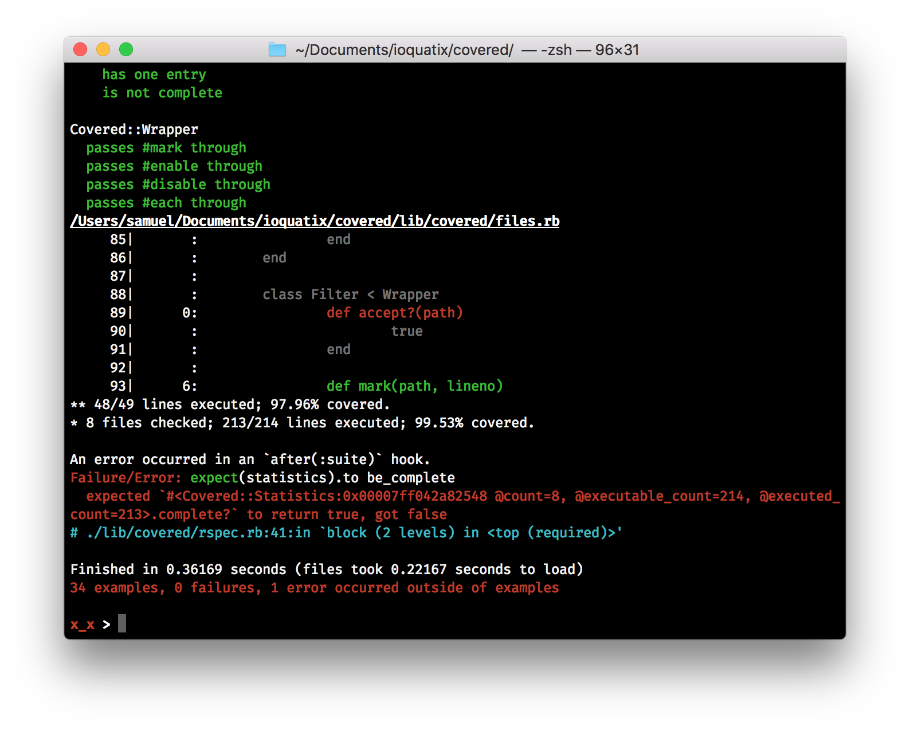

# Covered

Covered uses modern Ruby features to generate comprehensive coverage, including support for templates which are compiled
into Ruby.

  - Incremental coverage - if you run your full test suite, and the run a subset, it will still report the correct
    coverage - so you can incrementally work on improving coverage.
  - Integration with Sus, Git, RSpec and Minitest- no need to configure anything - out of the box support for these
    platforms.
  - Supports coverage of views - templates compiled to Ruby code can be tracked for coverage reporting.

## Motivation

Originally, Ruby coverage tools were unable to handle `eval`ed code. This is because the `coverage` module built into
Ruby doesn't expose the necessary hooks to capture it. Using the [parser](https://github.com/whitequark/parser) gem and
trace points allows us to do our own source code analysis to compute executable lines, thus making it possible to
compute coverage for "templates".

After this concept prooved useful, [it was integrated directly into Ruby](https://bugs.ruby-lang.org/issues/19008).

## Usage

Please see the [project documentation](https://socketry.github.io/covered/) for more details.

  - [Getting Started](https://socketry.github.io/covered/guides/getting-started/index) - This guide explains how to get started with `covered` and integrate it with your test suite.

  - [Configuration](https://socketry.github.io/covered/guides/configuration/index) - This guide will help you to configure covered for your project's specific requirements.

## Releases

Please see the [project releases](https://socketry.github.io/covered/releases/index) for all releases.

### v0.27.0

  - Drop development dependeny on `trenni` and add dependeny on `xrb`.

## See Also

  - [simplecov](https://github.com/colszowka/simplecov) – one of the original coverage implementations for Ruby, uses
    the built-in `coverage` library.
  - [sus](https://github.com/socketry/sus) - a test framework which uses `covered` to generate coverage reports.

## Contributing

We welcome contributions to this project.

1.  Fork it.
2.  Create your feature branch (`git checkout -b my-new-feature`).
3.  Commit your changes (`git commit -am 'Add some feature'`).
4.  Push to the branch (`git push origin my-new-feature`).
5.  Create new Pull Request.

### Developer Certificate of Origin

In order to protect users of this project, we require all contributors to comply with the [Developer Certificate of Origin](https://developercertificate.org/). This ensures that all contributions are properly licensed and attributed.

### Community Guidelines

This project is best served by a collaborative and respectful environment. Treat each other professionally, respect differing viewpoints, and engage constructively. Harassment, discrimination, or harmful behavior is not tolerated. Communicate clearly, listen actively, and support one another. If any issues arise, please inform the project maintainers.
